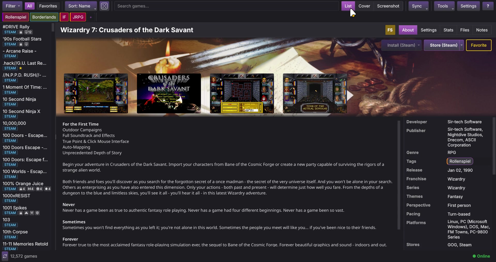
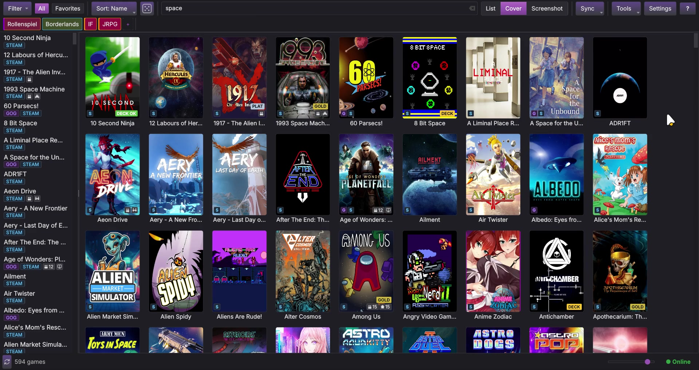
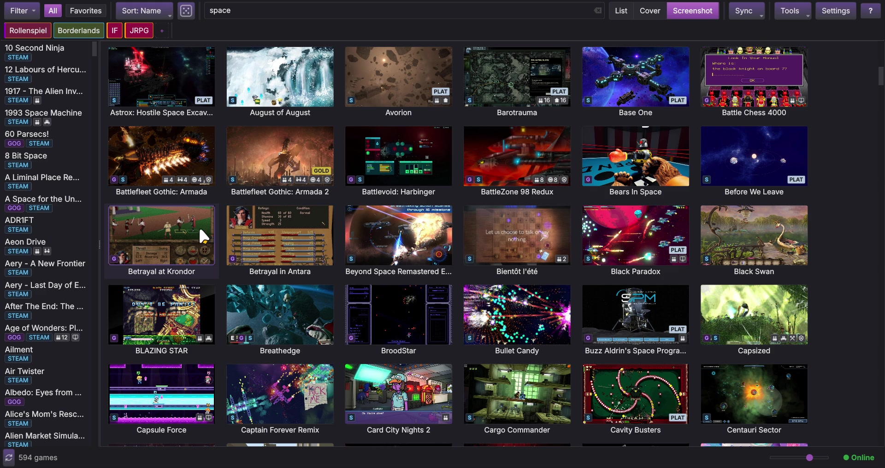
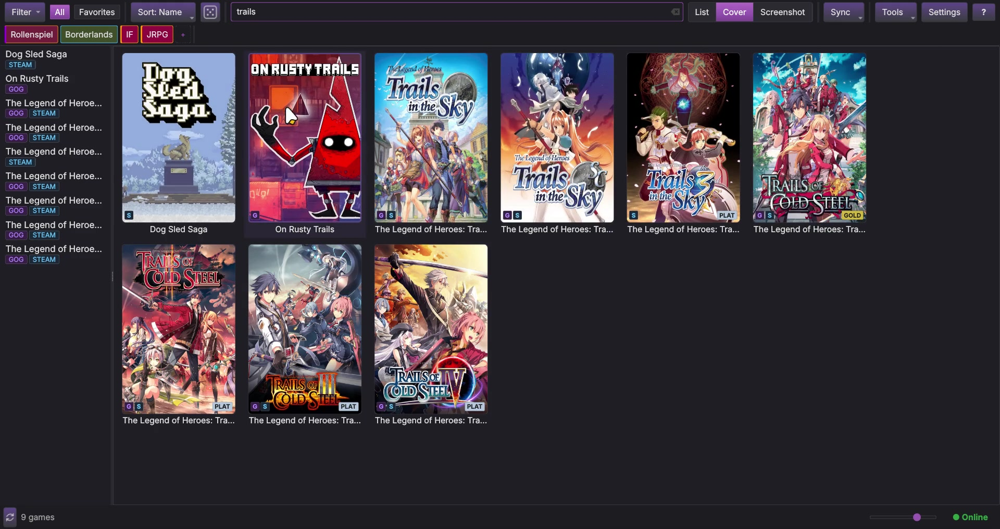
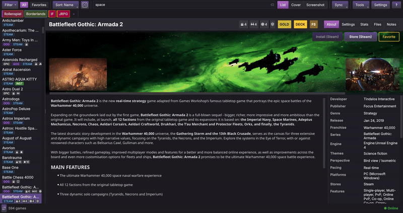
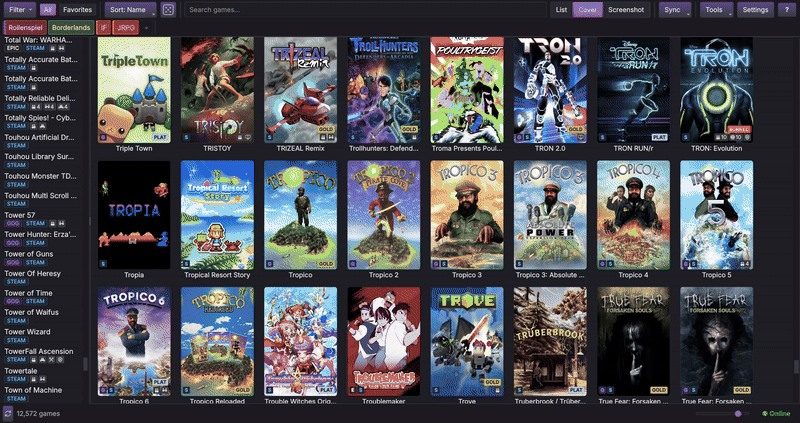

<div align="center">


# luducat

Your cross-platform game catalogue. One library, every store.

[**Linux (AppImage)**](https://github.com/luducat/luducat/releases) ·
[**Windows (Installer)**](https://github.com/luducat/luducat/releases) ·
[All Downloads](https://github.com/luducat/luducat/releases) ·
[Plugins](docs/wiki/Community-Plugins.md) ·
[Themes](docs/wiki/Community-Themes.md)


</div>

---

Switching between Steam, GOG, and Epic to remember what you own gets old.
luducat pulls your libraries into one catalogue that lives on your machine.
Games that appear in more than one store show up once. Metadata fills in
automatically without you lifting a finger. When you want to play something,
luducat hands it to whatever launcher you already use.

No accounts, user agency first, no telemetry, works offline after the first
full sync.

luducat is a catalogue browser, not a launcher or game manager. It shows you
what you own, brings metadata together, and delegates launching to your
existing tools. It works alongside your already installed launchers
cooperatively.

<a href="docs/screenshots/luducat-0.5.0-fulltour-1.jpg"></a>&nbsp;
<a href="docs/screenshots/luducat-0.5.0-cover-1.jpg"></a>&nbsp;
<a href="docs/screenshots/luducat-0.5.0-screenshots-1.jpg"></a>&nbsp;
<a href="docs/screenshots/luducat-0.5.0-filtering-1.jpg"></a>

<details>
<summary><h3>Videos</h3></summary>

**Full tour** · [Watch full video](https://luducat.org/videos.html#full-tour)


**Cover grid** · [Watch full video](https://luducat.org/videos.html#cover-grid)


**List view** · [Watch full video](https://luducat.org/videos.html#list-view)



**Screenshot grid** · [Watch full video](https://luducat.org/videos.html#screenshot-grid)


**Filtering** · [Watch full video](https://luducat.org/videos.html#filtering)


**Themes** · [Watch full video](https://luducat.org/videos.html#themes)



</details>

## What You Get

**Store Support** Steam, GOG, Epic. The plugin system is open, so more
stores can be added by anyone.

**Multiple ways to browse** a list with a detail panel, a cover browser, and
a screenshot mosaic. All stay smooth with large libraries. Open any game to
see its full page with hero art, screenshots, and everything luducat knows
about it.

**Find what you're looking for** filter by various criteria, statuses,
tags and fields or any combination. Sort however you like, as well let you
surprise.

**Covers and Metadata done right** luducat has a selection of various
metadata sources to get pretty covers and screenshots without much fiddling.
You can interactively change your preferred sources in your settings.

**Your tags, your way** create your custom tags and collect them from
various sources together. Want some specific tags easier access, luducat got
you covered.

**Launch from here** you can start your games from luducat, it hands them
over to your launchers. Batteries included in Linux, you can also start
games via Wine or other methods.

**Many built-in themes** follows your system by default (with automatic dark mode), or pick one of the
bundled packages and colour variants. Live preview in settings. Make your
own if you like.

**Backups** backup your library data with ease.

**Private by default** everything local. Credentials are saved securely.
No cloud, no tracking, no telemetry. Want to hide games from eyes, you can
do it.

**Language support** currently English, German, French, Spanish, Italian.

## Install

### Linux

**AppImage (recommended):**
```bash
chmod +x luducat-*.AppImage
./luducat-*.AppImage
```
Need FUSE? `sudo apt install libfuse2` (Debian/Ubuntu).

**Standalone binary:**
```bash
tar xzf luducat-*-x86_64.tar.gz
./luducat-*-x86_64
```

### Windows

Download the installer from
[Releases](https://github.com/luducat/luducat/releases) and run it. No admin
required.

### From Source

```bash
git clone https://github.com/luducat/luducat.git
cd luducat
./luducat.sh    # Linux/macOS
luducat.bat     # Windows
```

The launcher script sets up everything automatically.

### macOS

Source only. Untested. If you try it, let us know how it goes. We would
really like to get that going, help appreciated.

### First Run

A setup wizard walks you through the most important settings and gets you
going quickly.

<details>
<summary><strong>For Developers</strong></summary>

luducat has a plugin system with full
[SDK documentation](docs/plugins/Home.md), a
[quickstart guide](docs/plugins/quickstart.md), example plugins, and a
generator script. Plugins use the SDK exclusively and can be licensed under
any OSI-approved open source license.

- [Plugin SDK](docs/plugins/Home.md)
- [FAQ](docs/plugins/FAQ.md)
- [Community Plugins](docs/wiki/Community-Plugins.md)
- [Community Themes](docs/wiki/Community-Themes.md)
- [Security Model](docs/security-model.md)

Contributions welcome — especially store plugins, metadata providers, and
themes. This is alpha software; APIs may change between versions.

</details>

## Acknowledgments

Full attribution in the Credits tab and
[THIRD_PARTY_LICENSES.txt](THIRD_PARTY_LICENSES.txt).

## License

[GPL-3.0 with Plugin and Theme Exception](LICENSE). Plugins and themes using
only the SDK can use any OSI-approved license. Core modifications remain
GPL-3.0.

---

[Releases](https://github.com/luducat/luducat/releases) ·
[Issues](https://github.com/luducat/luducat/issues) ·
[Plugin SDK](docs/plugins/Home.md)

Built with AI-assisted development, using industry-standard software engineering practices. See [CONTRIBUTING.md](CONTRIBUTING.md) for exactly what that means.

Copyright (c) 2026 The Luducat Authors.
